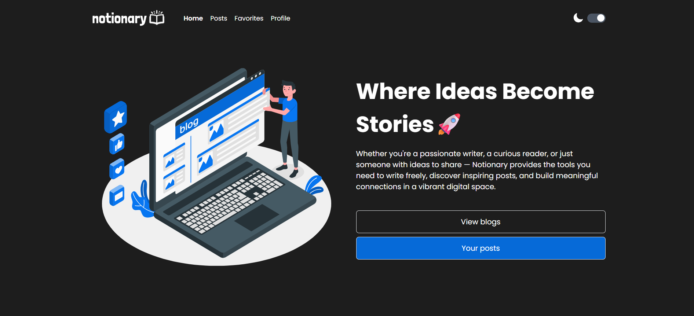
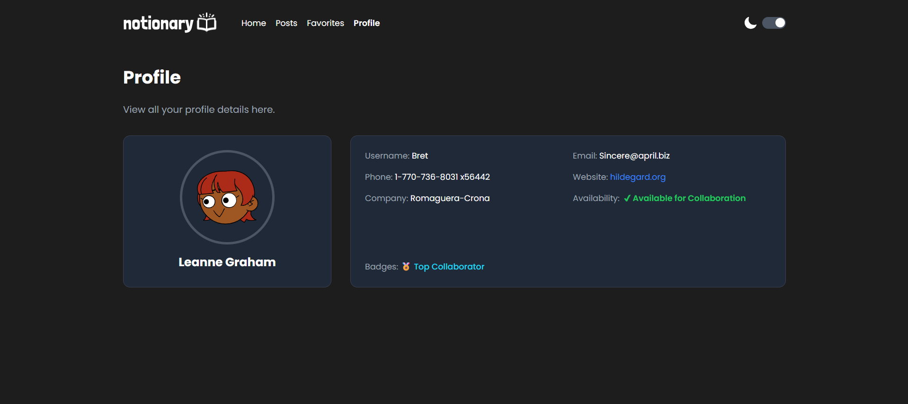
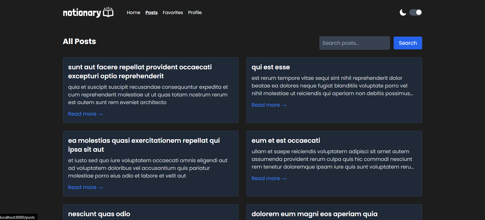
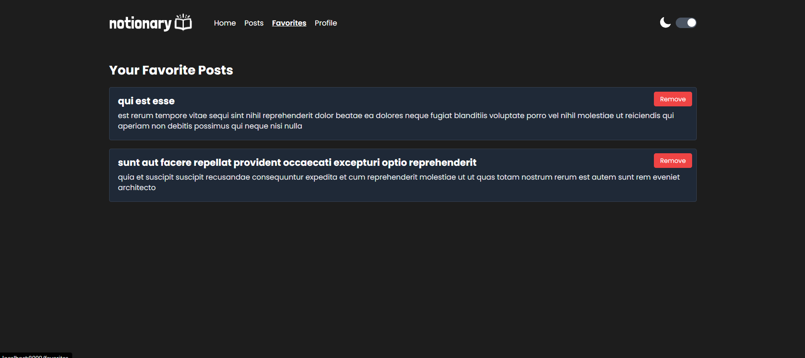

# 📝 Notionary – Laravel x Tailwind Project

## ⚙️ Setup Instructions

### 📦 Requirements
- PHP >= 8.1  
- Composer  
- Node.js & npm  
- Laravel 10+  
- Vite (default with Laravel)

### 🚀 Installation

```bash
git clone https://github.com/your-username/notionary-blog.git
cd notionary-blog

composer install
npm install

cp .env.example .env
php artisan key:generate

npm run dev
php artisan serve
```

---

## ✨ Features Implemented
- ✅ View all posts from JSONPlaceholder
- ✅ View post details with comments
- ✅ Create, edit, and delete posts (simulasi)
- ✅ Favorite system using `localStorage`
- ✅ See and manage favorites list
- ✅ Dark/light mode toggle menggunakan Tailwind
- ✅ Ganti logo & icon saat toggle dark/light
- ✅ Font `Poppins` di seluruh halaman
- ✅ Smooth scroll ke section menggunakan anchor `#posts`
- ✅ Paginate post list
- ✅ Tabel data dengan aksi edit/delete
- ✅ Tombol delete hanya simulasi (popup alert)

---

## 🧪 Technologies Used
- Laravel 10
- Tailwind CSS
- JavaScript (Vanilla)
- JSONPlaceholder API
- Vite
- LottieFiles (landing animation)
- Laravel Notify
---

## 🔌 API Endpoints Used
Semua endpoint dari: [https://jsonplaceholder.typicode.com](https://jsonplaceholder.typicode.com)

| Method | Endpoint                  | Keterangan                |
|--------|---------------------------|---------------------------|
| GET    | /posts                    | Ambil semua post          |
| GET    | /posts/{id}               | Ambil 1 post              |
| GET    | /posts/{id}/comments      | Ambil komentar per post   |
| GET    | /posts?userId=1           | Ambil post dari user ID   |
| POST   | /posts                    | Simulasi tambah post      |
| PUT    | /posts/{id}               | Simulasi update post      |
| GET    | /favorites                | Menyimpan semua post yang disukai|
| DELETE | /posts/{id}               | Hapus post                |

---

## Challenges & Solutions

### Data API tidak persistent
Karena JSONPlaceholder hanya mock API, semua perubahan seperti POST, PUT, DELETE tidak benar-benar menyimpan data. Maka simulasi dilakukan dan user diberikan feedback dengan laravel notify.

### Dark mode toggle
Menggunakan toggle switch berbasis `checkbox`, `dark:` class Tailwind, serta icon dinamis (sun/moon) + logo berubah saat dark mode.

### Favorites disimpan lokal
Menggunakan `localStorage` untuk menyimpan ID post yang disukai. Ditampilkan ulang saat user membuka halaman favorite dan tombol berubah sesuai state.

### Pagination
Karena API mengembalikan semua data sekaligus, digunakan `collect()->forPage()` dan `LengthAwarePaginator` agar pagination bisa berjalan manual.


## 📸 Preview

### 🟠 DarkMode



### 🟠 Profile



### 🟠 Post



### 🟠 Favorite


